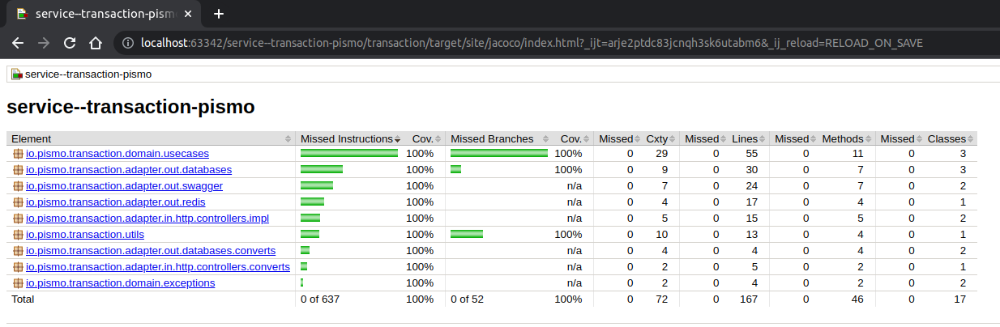

# Service Transaction Pismo

### Summary

This challenge was proposed by Pismo to create an application that registers accounts, retrieves a
customer's data and registers a transaction.

- Spring Boot 2.7.3
- Java 17 SE
- Postgresql 14
- Docker 20.10.17
- Dcoker Compose

### How to get this project

Before that you need check all the requirements above.
Check the follow ports in your computer is free: 8080, 8081 and 5432.

```shell
# Clone this repository
$ git clone <https://github.com/franklaercio/service--transaction-pismo.git>

# Go to the directory
$ cd service--transaction-pismo

# If all right, will to run the follow command
$ docker compose up -d

```

If you get any error, run this commands and try again:

```shell
$ docker rm $(docker ps -q -f status=exited)
$ docker compose up -d
```

In addition, the application can be accessed through the URL below:

```
# Heroku
https://service--transaction-pismo.herokuapp.com/service--transaction-pismo/swagger-ui/index.html
```

### CI/CD

As soon as a new commit is made to main, a new deployment is performed automatically in heroku.:

```
# CI using Github Actions
cd .github/workflows/maven.yml
```

### Project Structure

The project structure is based on the hexagonal architecture model, which aims to separate what is
an external dependency and what is the core of the application.

Therefore, the transaction was separate into domain, adapters and configs.

- *Domain*: layer responsible for to concentrate the business rules.
- *Adapters*: layer responsible for to concentrate external dependencies.
- *Configs*: layer responsible for to concentrate all the configurations for run this service.

Next, a drawing with the idea of architecture.

<p>
   
<p>

### Application Tests

At this moment the application is coverage by 100%. To achieve this, end-to-end testing was used,
unit tests for business rules and domain settings and entities ignored in coverage. You can check
the data accessing *target/site/index.html*, and you need to past all way to the *index.html*.

<p>
   
<p>

```shell
$ mvn clean install
```

### Docs

The *endpoints* documentation was implemented following the Swagger UI documentation tool.

```
http://localhost:8080/service--transaction-pismo/swagger-ui/index.html
```

In this url above, you look for the following endpoints:

- /service--transaction-pismo/accounts
- /service--transaction-pismo/accounts/accountId
- /service--transaction-pismo/transactions

### License

This project is licensed under the MIT License - see the LICENSE.md file for more information.

Done with :hearts: by Frank Laércio :wave:!
